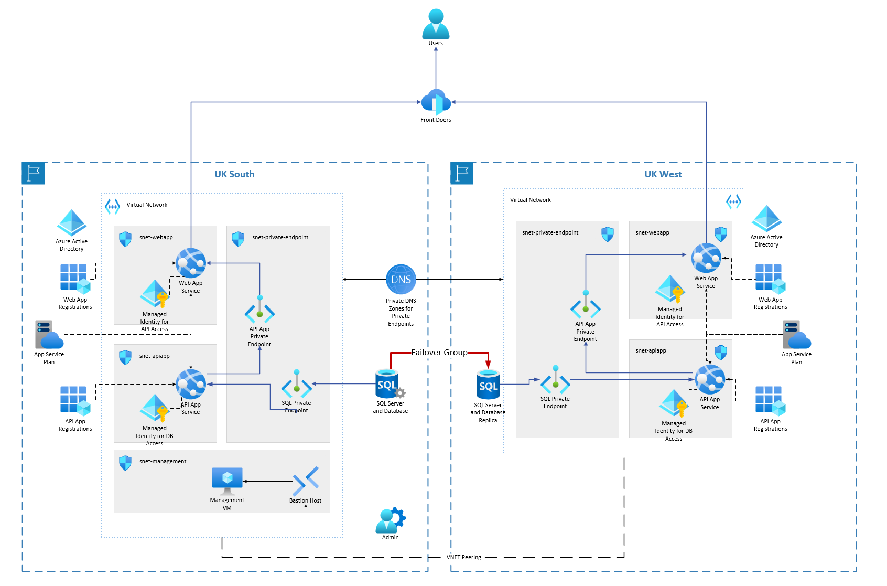

# ext-dev-main

A simple 3-tier demo application envrionment showing the implementation of mulit-zone, multi-region resiliency and relaibility design in Azure.

## Architecture Diagram



## Deployment Tools Required

- PowerShell Core v7.5.2 or later
- Azure CLI v2.77.0 or later
- Terraform v1.13.4 or later

## Deployment Steps

1. Open a PowerShell window and log in Azure using Azure CLI, and select the right subscription for deployment.

```bash
az login --tenant <tenant_id>
az account -s <subscritpion_id>
```

2. Change directory to the root of the repo, run the PowerShell script `scritps/create-app-registrations.ps1` to create the app registrations for the Web App and API App in both regions.

```powershell
./scripts/create-app-registrations.ps1 -apiAppNamePrefix apiapp -webAppNamePrefix webapp -primaryRegion uksouth -secondaryRegion ukwest -webAppUser judechen@microsoft.com
```

3. Copy the last 4 lines from the output of the script and run them under the PowerShell prompt to set some Terraform variables through environment variables. For example:

```powershell
$env:TF_VAR_web_app_primary_auth_client_id = "5d2d23b9-ed0a-4090-9ac1-a315b43e24e3"
$env:TF_VAR_api_app_primary_auth_client_id = "7844d963-cb0d-48e3-9c6c-184d5c518901"
$env:TF_VAR_web_app_secondary_auth_client_id = "d76c8c12-e570-4c29-a670-e3585d059676"
$env:TF_VAR_api_app_secondary_auth_client_id = "1222ff53-8fc4-4f5b-a6ad-13cfbb6d0dde"
```

4. Set one more Terraform variable for subscription ID.

```powershell
$env:ARM_SUBSCRIPTION_ID="<subscription_id>"
```

5. Run Terraform to deploy the Azure resources. (Note: if you see an error complaining about the RBAC permissions for the key vault, wait a couple of minutes and try to run the Terraform plan and apply commands again.)

```bash
terraform init
terraform plan -out tfplan.out
terraform apply "tfplan.out"
```

6. Run the PowerShell script `scripts\assign-managed-identity-api-access.ps1` to assign the API access to the managed identity of the web app.

```powershell
./scripts/assign-managed-identity-api-access.ps1 -apiAppNamePrefix apiapp -webAppNamePrefix webapp -primaryRegion uksouth -secondaryRegion ukwest -appRoleName Api.Read.Write
```

7. Go to the database in the primary region, open up the query editor. (If you see an error showing the SQL server is denying public network access, you may want to enable it temporarily in the networking setting of the SQL server instance.) In the query editor, load the `publish/artifacts/migrations.sql` script and execute it to create the test tables and records in the database.

8. Open a new query tab and run the below query again. You also need to run this query in the database in the secondary region, make sure to change the "apiapp-uksouth" to the API app name (e.g. "apiapp-ukwest") in the secondary region accordingly.

```sql
IF NOT EXISTS (SELECT name FROM [sys].[database_principals] WHERE name = N'apiapp-uksouth')
    BEGIN
        CREATE USER [apiapp-uksouth] FROM EXTERNAL PROVIDER;
        ALTER ROLE db_datareader ADD MEMBER [apiapp-uksouth];
        ALTER ROLE db_datawriter ADD MEMBER [apiapp-uksouth];
        ALTER ROLE db_ddladmin ADD MEMBER [apiapp-uksouth];
    END
```

9. Deploy the app zip packages in the `publish/artifacts` folder to the corresponding app services.

```
Sample.Api.zip --> API app in both regions.
Sample.Ui.uksouth.zip --> Web app in the primary region.
Sample.Ui.ukwest.zip --> Web app in the secondary region.
```

10. Test the application.